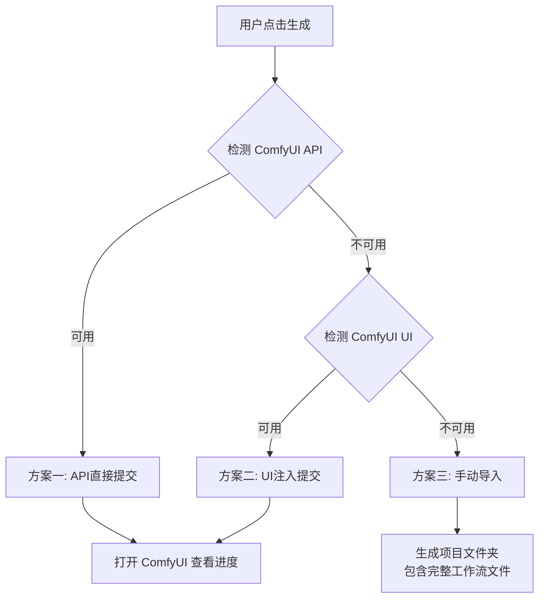

<p align="center">
  
  
</p>

<h1 align="center">🎬 MuseFlow Desktop</h1>

<p align="center">
  <strong>一键复刻任意视频转换为 AI 音乐MV视频 （一键复刻爆款mv)</strong><br>
  智能分析 · 自动抽帧 · 音频分离 · 一键生成 ComfyUI 工作流配置文件（可手动导入）
</p>

<p align="center">
  <a href="https://github.com/yourusername/MuseFlow-Desktop/stargazers">
    
  </a>
  <a href="https://github.com/yourusername/MuseFlow-Desktop/releases">
    
  </a>
  <a href="LICENSE">
    
  </a>
  <a href="https://www.electronjs.org/">
    
  </a>
</p>

<p align="center">
  <a href="#-demo">🎥 演示</a> •
  <a href="#-features">✨ 特性</a> •
  <a href="#-quick-start">🚀 快速开始</a> •
  <a href="#-how-it-works">🔧 工作原理</a> •
  <a href="#-architecture">🏗️ 架构</a> •
  <a href="#-contributing">🤝 贡献</a>
</p>

---

## 🎥 Demo

<p align="center">
  <a href="https://www.youtube.com/watch?v=cKa1hIwhz1c">
    
  </a>
  <br>
  <em>👆 点击观看完整演示视频</em>
</p>

## ✨ Features

### 🎯 一键式工作流

```
上传视频 → 智能分析 → 选择首帧 → 生成配置 → 提交 ComfyUI
    ↑                                                    ↓
    └──────────── 全程自动化，无需手动操作 ────────────────┘
```

| 功能 | 描述 | 状态 |
|------|------|------|
| 📁 **拖拽上传** | 支持直接拖放视频文件 | ✅ |
| 🎬 **智能抽帧** | 自动提取 5 张关键候选帧 | ✅ |
| 🎵 **音频分离** | FFmpeg 一键分离音视频轨道 | ✅ |
| 🖼️ **首帧选择** | 可视化界面选择最佳首帧 | ✅ |
| ✂️ **音频裁剪** | 精确裁剪音频片段 | ✅ |
| 📝 **提示词反推** | AI 自动生成 ComfyUI 提示词 | ✅ |
| 🎬 **多分镜生成** | Kimi AI 智能生成 4 分镜脚本 | ✅ |
| 🚀 **三级降级策略** | 智能 ComfyUI 集成，确保成功率 | ✅ |

### 🚀 三级降级策略 - 业界首创

MuseFlow 实现了**智能容错机制**，确保在各种环境下都能成功提交任务：



**方案对比：**

| 方案 | 成功率 | 速度 | 适用场景 |
|------|--------|------|----------|
| **API 直接提交** | ⭐⭐⭐⭐⭐ | ⚡ 最快 | ComfyUI 正常运行 |
| **UI 注入** | ⭐⭐⭐⭐ | 🚀 快 | API 端口未开放 |
| **手动导入** | ⭐⭐⭐⭐⭐ | 📁 标准 | 首次使用/模型下载中 |

### 🎨 双模式工作流

<table>
  <tr>
    <th width="50%">普通版 (Normal)</th>
    <th width="50%">大师版 (Master)</th>
  </tr>
  <tr>
    <td>
      • 单镜头快速生成<br/>
      • 适合快速测试<br/>
      • 生成速度: ⚡⚡⚡<br/>
      • 推荐新手使用
    </td>
    <td>
      • 4分镜丰富变化<br/>
      • AI 智能分镜脚本<br/>
      • 生成速度: ⚡⚡<br/>
      • 推荐专业制作
    </td>
  </tr>
</table>

---

## 🚀 Quick Start

### 安装

```bash
# 1. 克隆项目
git clone https://github.com/yourusername/MuseFlow-Desktop.git
cd MuseFlow-Desktop

# 2. 安装依赖
npm install

# 3. 启动应用
npm start
```

### 下载预编译版本

| 平台 | 下载 | 大小 |
|------|------|------|
| **macOS (Apple Silicon)** | [Download](https://github.com/yourusername/MuseFlow-Desktop/releases/latest) | ~150 MB |
| **macOS (Intel)** | [Download](https://github.com/yourusername/MuseFlow-Desktop/releases/latest) | ~150 MB |
| **Windows** | [Download](https://github.com/yourusername/MuseFlow-Desktop/releases/latest) | ~180 MB |

---

## 🔧 How It Works

### 工作流程

```
┌─────────────────────────────────────────────────────────────────────┐
│                         用户操作流程                                 │
├─────────────────────────────────────────────────────────────────────┤
│                                                                     │
│  1️⃣  上传视频     ──────▶  拖放或选择视频文件                       │
│       ↓                                                            │
│  2️⃣  智能分析     ──────▶  FFmpeg 提取关键帧 + 分离音频              │
│       ↓                                                            │
│  3️⃣  选择首帧     ──────▶  可视化选择最佳首帧图                      │
│       ↓                                                            │
│  4️⃣  AI 生成      ──────▶  反推生图提示词 + 生视频脚本 (可选)            │
│       ↓                                                            │
│  5️⃣  生成配置     ──────▶  注入参数到工作流模板                      │
│       ↓                                                            │
│  6️⃣  提交 ComfyUI ──────▶  三级降级策略自动选择最佳方案              │
│       ↓                                                            │
│  🎉  完成!        ──────▶  在 ComfyUI 中查看生成进度                 │
│                                                                     │
└─────────────────────────────────────────────────────────────────────┘
```

### 生成的项目结构

```
project-uuid/
├── 🖼️ frame.jpg              # 选中的首帧图
├── 🎵 audio.wav              # 分离的音频 (16kHz, 单声道)
├── 📄 workflow_normal.json   # 普通版 - API 格式
├── 📄 workflow_normal_ui.json # 普通版 - UI 格式
├── 📄 workflow_master.json   # 大师版 - API 格式
├── 📄 workflow_master_ui.json # 大师版 - UI 格式
└── 📄 config.json            # 完整配置信息
```

---

## 🏗️ Architecture

### 技术栈

<p align="center">
  
  
  
  
  
</p>

### 系统架构

```
┌─────────────────────────────────────────────────────────────────────────┐
│                           MuseFlow Desktop                               │
│                      (Electron + Node.js)                                │
├─────────────────────────────────────────────────────────────────────────┤
│                                                                          │
│  ┌─────────────────────┐  ┌─────────────────────┐  ┌──────────────────┐ │
│  │   🖥️ 主进程         │  │   🎨 渲染进程        │  │   🔌 ComfyUI 集成 │ │
│  │   (main.js)         │  │   (app.js)          │  │                  │ │
│  ├─────────────────────┤  ├─────────────────────┤  ├──────────────────┤ │
│  │ • FFmpeg 调用       │  │ • UI 交互           │  │ • API 客户端      │ │
│  │ • 文件系统操作      │  │ • 状态管理          │  │ • 工作流注入器    │ │
│  │ • IPC 通信          │  │ • 事件处理          │  │ • 窗口加载器      │ │
│  │ • 窗口管理          │  │ • 调用主进程 API    │  │ • 预加载脚本      │ │
│  └─────────────────────┘  └─────────────────────┘  └──────────────────┘ │
│           │                        │                        │           │
│           └────────────────────────┼────────────────────────┘           │
│                                    │                                    │
│                                    ▼                                    │
│  ┌─────────────────────────────────────────────────────────────────┐   │
│  │                      外部依赖层                                   │   │
│  │  ┌──────────┐  ┌──────────┐  ┌──────────┐  ┌──────────────┐    │   │
│  │  │  FFmpeg  │  │ ComfyUI  │  │ Kimi AI  │  │  系统 FFmpeg │    │   │
│  │  └──────────┘  └──────────┘  └──────────┘  └──────────────┘    │   │
│  └─────────────────────────────────────────────────────────────────┘   │
│                                                                          │
└─────────────────────────────────────────────────────────────────────────┘
```

### 核心模块

| 模块 | 文件 | 职责 |
|------|------|------|
| **主进程** | `main.js` | FFmpeg 调用、文件操作、IPC 管理 |
| **渲染进程** | `app.js` | UI 交互、状态管理、用户事件 |
| **安全桥接** | `preload.js` | 主进程与渲染进程的安全通信 |
| **工作流注入** | `workflowInjector.js` | 将音视频路径注入工作流模板 |
| **API 客户端** | `comfyui-api.js` | ComfyUI REST API 封装 |
| **窗口加载** | `comfyui-loader.js` | ComfyUI 窗口创建和管理 |
| **预加载脚本** | `comfyui-preload.js` | 注入到 ComfyUI 页面的自动化脚本 |

### IPC 通信示例

```javascript
// 渲染进程调用
const result = await window.electronAPI.generateWorkflowConfig({
  selectedFrame: '/path/to/frame.jpg',
  audioPath: '/path/to/audio.wav',
  prompt: '现代化舞台场景，霓虹灯光',
  workflowType: 'master',
  storyboard: generatedScenes
});

// 主进程处理
ipcMain.handle('generate-workflow', async (event, data) => {
  const workflow = await workflowInjector.create(data);
  await comfyUIAPI.submit(workflow);
  return { success: true, projectPath };
});
```

---

## 📁 Project Structure

```
MuseFlow-Desktop/
├── 📂 src/                          # 源代码
│   ├── 📄 main.js                   # Electron 主进程入口
│   ├── 📄 preload.js                # 安全桥接脚本
│   ├── 📄 app.js                    # 前端交互逻辑
│   ├── 📄 index.html                # 主界面 HTML
│   ├── 📄 styles.css                # 暗黑主题样式
│   ├── 📄 workflowInjector.js       # 工作流参数注入器
│   ├── 📄 comfyui-api.js            # ComfyUI API 客户端 ⭐
│   ├── 📄 comfyui-loader.js         # ComfyUI 窗口加载器
│   ├── 📄 comfyui-preload.js        # ComfyUI 预加载脚本
│   ├── 📄 loading.html              # Loading 界面
│   └── 📄 loading-preload.js        # Loading 预加载脚本
│
├── 📂 templates/                    # 工作流模板
│   ├── 📄 InfiniteTalk20251121.json           # 普通版模板
│   └── 📄 最终版_AI歌手大师版+humo+infinite talk+lynx多分镜.json
│
├── 📂 python/                       # Python 脚本（可选）
│   └── 📄 create_basic_workflow.py  # 基础工作流生成
│
├── 📂 assets/                       # 静态资源
│   ├── 🖼️ icon.icns                 # macOS 图标
│   ├── 🖼️ icon.ico                  # Windows 图标
│   └── 🖼️ museflow-logo.png         # 应用 Logo
│
├── 📄 package.json                  # 项目配置和依赖
├── 📄 README.md                     # 项目说明（本文件）
├── 📄 DEPENDENCIES.md               # 详细依赖说明
├── 📄 CHANGELOG.md                  # 更新日志
├── 📄 PROGRESS.md                   # 开发进度
└── 📄 test_api.js                   # API 测试脚本
```

---

## 🛠️ Development

### 环境要求

- **Node.js**: >= 16.0.0 (推荐 20.x)
- **npm**: >= 8.0.0
- **FFmpeg**: >= 4.4
- **ComfyUI Desktop**: 最新版（可选但推荐）

### 开发命令

```bash
# 安装依赖
npm install

# 开发模式（热重载）
npm start

# 运行测试
node test_api.js

# 打包 macOS
npm run build:mac

# 打包 Windows
npm run build:win

# 打包所有平台
npm run build
```

### 环境变量

```bash
# 创建 .env 文件
cp .env.example .env

# 编辑 .env
MOONSHOT_API_KEY=sk-your-kimi-api-key  # 可选，用于多分镜生成
```

---

## 🤝 Contributing

我们欢迎所有形式的贡献！

### 如何贡献

1. **Fork** 本项目
2. 创建你的特性分支：`git checkout -b feature/AmazingFeature`
3. 提交更改：`git commit -m 'Add some AmazingFeature'`
4. 推送到分支：`git push origin feature/AmazingFeature`
5. 打开 **Pull Request**

### 贡献指南

- 📖 [贡献指南](./CONTRIBUTING.md)
- 🐛 [提交 Issue](https://github.com/yourusername/MuseFlow-Desktop/issues)
- 💡 [功能建议](https://github.com/yourusername/MuseFlow-Desktop/discussions)

### 贡献者

<a href="https://github.com/yourusername/MuseFlow-Desktop/graphs/contributors">
  
</a>

---

## 🗺️ Roadmap

### 2024 Q1
- [x] 基础视频分析和 ComfyUI 集成
- [x] 三级降级策略
- [x] 双模式工作流（普通版/大师版）

### 2024 Q2
- [ ] 批量视频处理
- [ ] 自定义工作流模板
- [ ] 云端队列管理
- [ ] 多语言支持

### 2024 Q3
- [ ] 视频风格迁移
- [ ] 实时预览功能
- [ ] 插件系统
- [ ] 社区模板市场

---

## 💬 Community

- 💬 [Discord](https://discord.gg/museflow)
- 🐦 [Twitter](https://twitter.com/museflow)
- 📧 [Email](mailto:hello@museflow.app)

---

## 📄 License

MIT License © 2024 MuseFlow Team

详见 [LICENSE](./LICENSE) 文件

---

## 🙏 Acknowledgments

- [Electron](https://www.electronjs.org/) - 跨平台桌面应用框架
- [ComfyUI](https://github.com/comfyanonymous/ComfyUI) - 强大的 AI 图像/视频生成工具
- [FFmpeg](https://ffmpeg.org/) - 音视频处理神器
- [Kimi AI](https://kimi.moonshot.cn/) - 智能分镜生成
- [electron-builder](https://www.electron.build/) - 应用打包工具

---

<p align="center">
  <strong>如果这个项目对你有帮助，请给我们一个 ⭐ Star！</strong>
</p>

<p align="center">
  <a href="https://github.com/yourusername/MuseFlow-Desktop/stargazers">
    
  </a>
</p>

<p align="center">
  Made with ❤️ by <a href="https://github.com/yourusername">MuseFlow Team</a>
</p>
